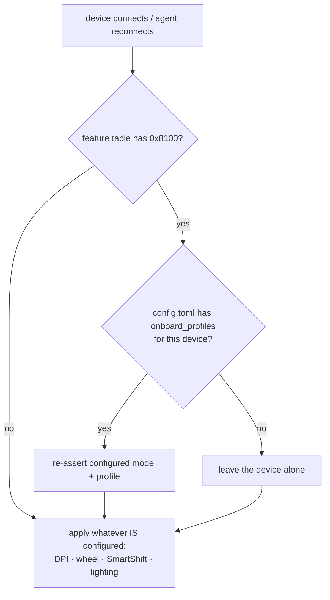
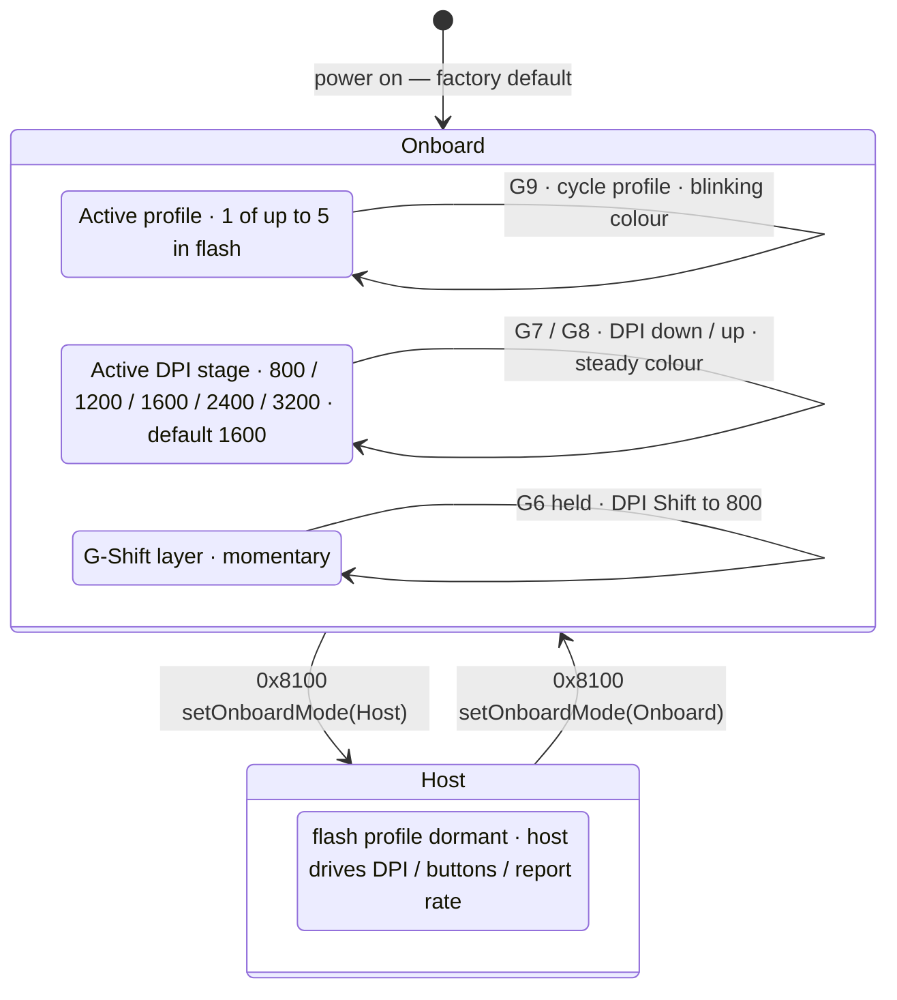

---
paths:
  - "crates/openlogi-hidpp/src/feature/onboard_profiles/**"
  - "crates/openlogi-hid/src/onboard_profiles.rs"
  - "crates/openlogi-hid/src/write/onboard_profiles.rs"
  - "crates/openlogi-agent-core/src/orchestrator.rs"
  - "crates/openlogi-agent-core/src/hardware.rs"
  - "crates/openlogi-gui/src/components/profiles_panel.rs"
  - "crates/openlogi-cli/src/cmd/diag/profiles.rs"
---

# Onboard profiles — HID++ `0x8100`

Gaming mice keep profiles in their own flash and switch between them from
buttons on the device, with no host involved. That is the whole reason this
feature is awkward: OpenLogi is not the only writer of the state it displays,
and the device's own UI for that state is a coloured LED.

The surface spans five crates — read the one you are changing, but the
sequencing rules below cut across all of them:

- `openlogi-hidpp/src/feature/onboard_profiles/` — the protocol wrapper.
  `mod.rs` holds the eight endpoint calls, `types.rs` the parsed description,
  directory entries, `ROM_SECTOR_FLAG` and `DIRECTORY_SECTOR`.
- `openlogi-hid/src/onboard_profiles.rs` — the IPC-facing types
  (`ProfilesMode`, `ProfileEntry`, `OnboardProfilesInfo`) and `is_rom_sector`.
- `openlogi-hid/src/write/onboard_profiles.rs` — the I/O verbs
  (`get_onboard_profiles`, `set_profiles_mode`, `set_active_profile`,
  `apply_profiles_config`) and the firmware byte mapping.
- `openlogi-agent-core/src/orchestrator.rs` — `configured_onboard_profiles`
  (the consent policy) and `reapply_volatile_settings` (the sequencing).
- `openlogi-agent-core/src/hardware.rs` —
  `apply_onboard_profiles_in_background`, the thread that owns the write.
- `openlogi-gui/src/components/profiles_panel.rs` — the panel.
- `openlogi-cli/src/cmd/diag/profiles.rs` — the round-trip diagnostic.

Reference device is a G502 X LIGHTSPEED ([setup guide][qsg], pages 8–9); it is
the only one anyone has run this against. The official `0x8100` spec is not
public, so several facts below are bench observations, marked as such.

[qsg]: https://www.logitech.com/assets/66193/3/g502-x-artanis-web-qsg.pdf

## The firmware rejects half of what you'd expect, which fixes the ordering

**Onboard mode rejects host writes.** DPI comes back `InvalidArgument` while the
device is onboard (observed). This is why `reapply_volatile_settings` does not
fan its writes out into parallel threads: it bundles wheel mode, lighting, DPI
and SmartShift into the `after` continuation of
`apply_onboard_profiles_in_background`, so the mode switch is guaranteed to land
first. If you flatten that back into parallel spawns, DPI silently stops
applying on any gaming mouse — and only on a gaming mouse, so it survives every
test on other hardware.

**Host mode rejects `set_current_profile`.** The active-profile write is legal
only inside an onboard-mode window. `openlogi diag profiles` enters onboard mode
for exactly that reason, not as a side effect.

**The continuation must outlive a panic.** It carries the entire rest of the
volatile reapply, so it runs from a drop guard rather than as the last statement
of the spawned thread. Do not "simplify" it back to a trailing call.

**The mode is volatile.** The mouse powers on in onboard mode every time, so a
configured mode has to be re-asserted on every reconnect. Never skip the reapply
because the device reported the right mode in an earlier session.

Smaller ones, same category: `memory_read` rejects offsets past
`sector_size - 16`, so a full-sector read fetches its last partial chunk from
`sector_size - 16`; erased flash reads back as `0xFF`, which parses as the
directory terminator, so an empty directory is a legal state and not a failure;
ROM profiles carry `ROM_SECTOR_FLAG` (`0x0100`) and the bit is never re-derived
at a call site — go through `openlogi_hid::is_rom_sector`.

## Never switch a device's mode uninvited

`configured_onboard_profiles` returns `None` when the user has not chosen a
mode, and the device keeps whatever mode it powered on in.

This is not a preference, it is a consequence of the LED being the only feedback
channel. A host-mode switch the user did not ask for discards the profile they
selected on the mouse itself, with nothing on screen and nothing on the device
to explain it. The tempting fix — "default to host mode so our DPI actually
applies" — is precisely the bug this policy exists to prevent. If you are
writing that fallback, stop and read this section again.

The live consequence: DPI configured in OpenLogi will not apply to a mouse
sitting in onboard mode, and the write fails with `InvalidArgument`. Surfacing
that to the user is unsolved. Do not solve it by taking the mode.

## What the device does while you are not looking

G502 X controls: G1/G2/G3 clicks, G4/G5 side, G6 DPI Shift, G7/G8 DPI down/up,
G9 profile cycle, wheel tilt L/R — 13 programmable; the wheel-mode toggle and
the power switch are not. Factory profiles are MAIN "GAMING" (1 ms report rate,
G6 = DPI Shift to 800) and SECONDARY "PRODUCTIVITY" (2 ms, G6 = G-Shift layer),
both on DPI steps 800/1200/1600/2400/3200 at 1600 default, coloured 1 White,
2 Orange, 3 Teal, 4 Yellow, 5 Magenta. Up to 5 profiles unlock in G HUB.

Per the guide: _"DPI change is expressed by different steady colors, while
profile change is displayed by different blinking colors."_

## Reading state back — currently one-shot, by omission

The GUI reads onboard-profiles state **once** per device
(`profiles_panel.rs`, `ensure_profiles_load`), and nothing anywhere in
`openlogi-hid` or the agent subscribes to HID++ feature events. So a profile
cycled with G9 is invisible until the panel is retried. This is current state,
not a bug to re-report — fix it or leave it.

Closing it is not symmetric work: `0x2202` already decodes `ParametersChanged`
("e.g. via a DPI button") in the vendored fork and the decoder is simply unused,
whereas `0x8100` has no event support in the fork at all, so reflecting a
device-side profile change means adding the event there first.

## Wire format

`ProfilesMode` and `ProfileEntry` cross the agent↔GUI IPC, so variant order and
field order are wire format: changes need a `PROTOCOL_VERSION` bump and
regenerated goldens (`.claude/rules/ipc-protocol.md`). The GUI panel gates on
`Capabilities::onboard_profiles`, never on device `kind`.

## Build & verify

`openlogi diag profiles` is the round-trip and the fastest proof a change works:
it reads the description and directory, enters onboard mode, sets and restores
the active profile, then restores the original mode — on the error path too.
`--read-only` skips every write; `--leave-onboard` skips the final mode restore,
which is how you set the device up to test the agent's reapply on reconnect.

Unit tests cover the parsers (`onboard_profiles/tests.rs`) and the ROM flag, and
they run everywhere. Nothing else here is testable without hardware: the whole
feature is firmware behaviour. Real-device verification is the maintainer's job
— state plainly what you did not test rather than implying coverage.

## Unverified — resolve on hardware, do not reason about

- Whether G7/G8 still change DPI, and G9 still cycles profiles, in **host** mode,
  or whether they become plain reprogrammable buttons.
- Whether the DPI stage list lives in the device (`0x2202 getSensorDpiList`) or
  in host-side state while in host mode.
- Whether the LED still tracks DPI and profile in host mode.
- Every gaming mouse that is not a G502 X. The behaviour above is generalised
  from a single device; a second device's quirks are new facts to record here,
  not bugs to fix.
