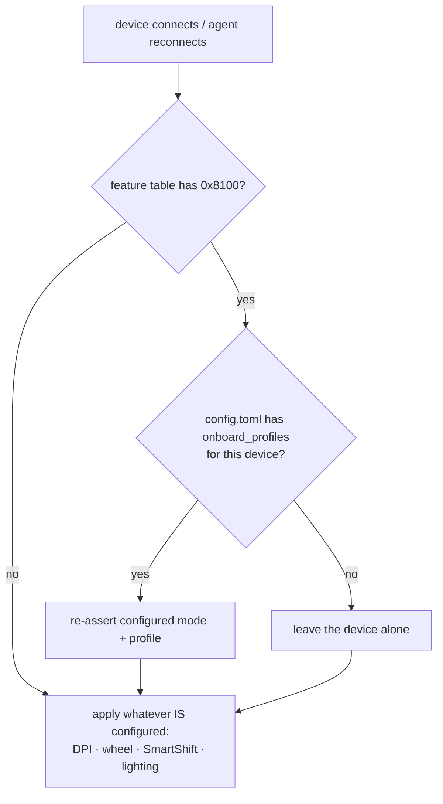
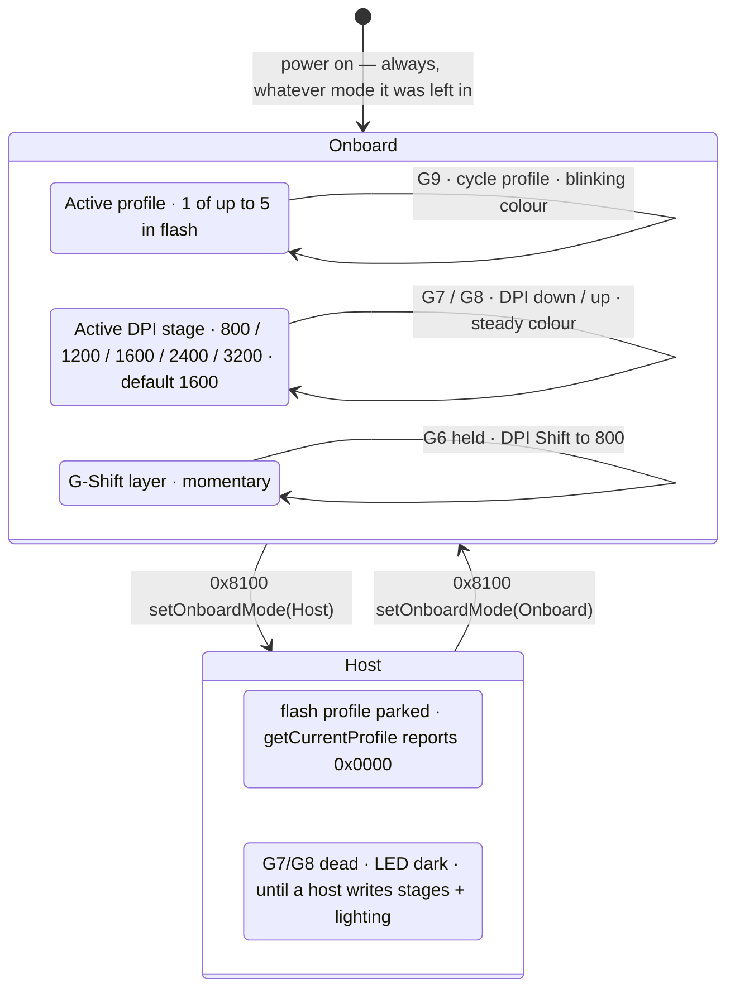

---
paths:
  - "crates/openlogi-hidpp/src/feature/onboard_profiles/**"
  - "crates/openlogi-hid/src/onboard_profiles.rs"
  - "crates/openlogi-hid/src/write/onboard_profiles.rs"
  - "crates/openlogi-agent-core/src/orchestrator.rs"
  - "crates/openlogi-agent-core/src/hardware.rs"
  - "crates/openlogi-gui/src/components/profiles_panel.rs"
  - "crates/openlogi-cli/src/cmd/diag/profiles.rs"
---

# Onboard profiles — HID++ `0x8100`

Gaming mice keep profiles in their own flash and switch between them from
buttons on the device, with no host involved. That is the whole reason this
feature is awkward: OpenLogi is not the only writer of the state it displays,
and the device's own UI for that state is a coloured LED.

The surface spans five crates — read the one you are changing, but the
sequencing rules below cut across all of them:

- `openlogi-hidpp/src/feature/onboard_profiles/` — the protocol wrapper.
  `mod.rs` holds the eight endpoint calls, `types.rs` the parsed description,
  directory entries, `ROM_SECTOR_FLAG` and `DIRECTORY_SECTOR`.
- `openlogi-hid/src/onboard_profiles.rs` — the IPC-facing types
  (`ProfilesMode`, `ProfileEntry`, `OnboardProfilesInfo`) and `is_rom_sector`.
- `openlogi-hid/src/write/onboard_profiles.rs` — the I/O verbs
  (`get_onboard_profiles`, `set_profiles_mode`, `set_active_profile`,
  `apply_profiles_config`) and the firmware byte mapping.
- `openlogi-agent-core/src/orchestrator.rs` — `configured_onboard_profiles`
  (the consent policy) and `reapply_volatile_settings` (the sequencing).
- `openlogi-agent-core/src/hardware.rs` —
  `apply_onboard_profiles_in_background`, the thread that owns the write.
- `openlogi-gui/src/components/profiles_panel.rs` — the panel.
- `openlogi-cli/src/cmd/diag/profiles.rs` — the round-trip diagnostic.

Reference device is a G502 X LIGHTSPEED ([setup guide][qsg], pages 8–9); it is
the only one anyone has run this against. The official `0x8100` spec is not
public, so several facts below are bench observations, marked as such.

[qsg]: https://www.logitech.com/assets/66193/3/g502-x-artanis-web-qsg.pdf

## What the firmware actually rejects

**Onboard mode does not reject host writes.** Bench-checked on a G502 X LS
(2026-07-26): DPI round-trips 1600→1650→1600 in onboard mode, in host mode, and
immediately after a mode write. An earlier note here claimed onboard mode
answered DPI with `InvalidArgument` — that was a misread of the cross-talk bug
below. Do not reintroduce it.

**Host mode rejects `set_current_profile`.** `InvalidArgument`, confirmed on the
same bench run. The active-profile write is legal only inside an onboard-mode
window, which is why `openlogi diag profiles` enters onboard mode — not as a
side effect.

**Concurrent verbs on one device get each other's replies.** HID++ correlates a
reply to its request only by `(device index, feature index, function, software
id)`, and every verb opens with the same `0x0000 getFeature` header at the
channel's fixed software id. Two in flight at once therefore cross-match.
Observed: `set_profiles_mode || set_dpi` → DPI `InvalidArgument` 3/3 (the DPI
payload lands on `0x8100`'s index); `set_dpi || set_scroll_wheel_mode` → `0x2121`
reported unsupported though the feature table lists it; `get_dpi ||
set_profiles_mode` → `Ok(0)`, silently wrong with no error. `openlogi-hid`'s
`write::exchange()` lock now serializes every verb; anything that opens a channel
outside `with_route` or the `*_on` fast paths has to take it too.

**Order still matters inside the reapply.** Not because onboard mode blocks
writes, but because activating a profile reloads that profile's DPI and the rest
of its stored settings out of flash — a DPI write that landed first would be
overwritten. That is what the `after` continuation of
`apply_onboard_profiles_in_background` is for.

**The continuation must outlive a panic.** It carries the entire rest of the
volatile reapply, so it runs from a drop guard rather than as the last statement
of the spawned thread. Do not "simplify" it back to a trailing call.

**The mode is volatile — confirmed 2026-07-26.** A G502 X LS left in host mode
came back in onboard mode after a power cycle, with sector `0x0002` active again.
So a configured mode has to be re-asserted on every reconnect; never skip the
reapply because the device reported the right mode in an earlier session.

**Host mode reports active profile `0x0000`.** Not "never activated" — host mode
parks the flash profile, so `get_current_profile` has nothing to name. `0x0000`
is not a writable target, which is why the `diag profiles` round-trip skips its
restore step when it found the device in host mode.

Never re-derive `ROM_SECTOR_FLAG` at a call site — go through
`openlogi_hid::is_rom_sector`.

## Never switch a device's mode uninvited

`configured_onboard_profiles` returns `None` when the user has not chosen a
mode, and the device keeps whatever mode it powered on in.

This is not a preference, it is a consequence of the LED being the only feedback
channel. A host-mode switch the user did not ask for discards the profile they
selected on the mouse itself, with nothing on screen and nothing on the device
to explain it. Worse on a G502 X: host mode leaves the DPI stages and the LED
unset, so G7/G8 stop stepping DPI and the light goes dark until a host writes
them — G HUB only looks lossless there because it pushes a full configuration
the moment it takes the mode.

The policy is also cheaper than it used to look. "DPI cannot apply while the
mouse is onboard" was the reason to want the fallback, and it is false (see
above) — DPI writes land in either mode. They only survive until the next
profile switch reloads flash, which is a persistence question, not a blocked
write, and one the user causes with a button they can see.

## What the device does while you are not looking

G502 X controls: G1/G2/G3 clicks, G4/G5 side, G6 DPI Shift, G7/G8 DPI down/up,
G9 profile cycle, wheel tilt L/R — 13 programmable; the wheel-mode toggle and
the power switch are not. Factory profiles are MAIN "GAMING" (1 ms report rate,
G6 = DPI Shift to 800) and SECONDARY "PRODUCTIVITY" (2 ms, G6 = G-Shift layer),
both on DPI steps 800/1200/1600/2400/3200 at 1600 default, coloured 1 White,
2 Orange, 3 Teal, 4 Yellow, 5 Magenta. Up to 5 profiles unlock in G HUB.

Per the guide: _"DPI change is expressed by different steady colors, while
profile change is displayed by different blinking colors."_

## Reading state back — currently one-shot, by omission

The GUI reads onboard-profiles state **once** per device
(`profiles_panel.rs`, `ensure_profiles_load`), and nothing anywhere in
`openlogi-hid` or the agent subscribes to HID++ feature events. So a profile
cycled with G9 is invisible until the panel is retried. This is current state,
not a bug to re-report — fix it or leave it.

Closing it means adding event support to the fork: `0x8100` has none, and the
`ParametersChanged` decoder that does exist is on `0x2202`, which the reference
device does not expose (it reports `0x2201 v2`).

## Wire format

`ProfilesMode` and `ProfileEntry` cross the agent↔GUI IPC, so variant order and
field order are wire format: changes need a `PROTOCOL_VERSION` bump and
regenerated goldens (`.claude/rules/ipc-protocol.md`). The GUI panel gates on
`Capabilities::onboard_profiles`, never on device `kind`.

## Build & verify

`openlogi diag profiles` is the round-trip and the fastest proof a change works:
it reads the description and directory, enters onboard mode, sets and restores
the active profile, then restores the original mode — on the error path too.
`--read-only` skips every write; `--leave-onboard` skips the final mode restore,
which is how you set the device up to test the agent's reapply on reconnect.

Unit tests cover the parsers (`onboard_profiles/tests.rs`) and the ROM flag, and
they run everywhere. Nothing else here is testable without hardware: the whole
feature is firmware behaviour. Real-device verification is the maintainer's job
— state plainly what you did not test rather than implying coverage.

## Host mode is not free — the host inherits the profile's job

Maintainer observation on a G502 X LS, 2026-07-26: in the host mode OpenLogi
writes, **G7/G8 no longer step DPI and the LED is dark**. In G HUB's host mode
both still work. The difference is not the mode, it is that OpenLogi writes the
mode and nothing else — the DPI stage list, the lighting, and the button
assignments all came from the flash profile that host mode just parked.

So host mode is only usable once OpenLogi can supply those itself, and the
feature table says how far that can go. Present and unwrapped: `0x8060` (report
rate), `0x8110` (button spy — the likely way a host watches G7/G8 without
`0x1b04`, unverified). Absent entirely: **`0x1b04`**, so HID++ button remapping
is impossible here and the OS hook is the only path — and **any `0x807x`/`0x8081`
lighting feature**, so nothing OpenLogi can send will light the LED while the
profile that owns it is parked. How G HUB lights it in host mode is unexplained;
do not assume a feature that is not in the table.

Until that is closed, host mode is a downgrade on this device. Keep it opt-in and
say so in the UI rather than making it the default.

## Unverified — resolve on hardware, do not reason about

- Whether G9 still cycles profiles in host mode (G7/G8 and the LED are answered
  above; G9 was not separately checked).
- Where the DPI stage list lives in host mode. Note the reference device exposes
  `0x2201 v2`, **not** `0x2202` — any plan that leans on `0x2202 getSensorDpiList`
  or its `ParametersChanged` event does not apply to a G502 X.
- Every gaming mouse that is not a G502 X. The behaviour above is generalised
  from a single device; a second device's quirks are new facts to record here,
  not bugs to fix.
