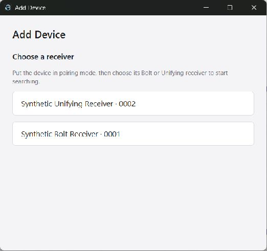

# Pair a wireless device

Open **Add Device**, put your device in pairing mode, and choose the receiver
you want to use. Use a Bolt receiver for a Bolt device and a Unifying receiver
for a Unifying device. OpenLogi shows the receiver name and the last four
characters of its identifier so you can distinguish connected receivers.

For Bolt, select the discovered device and follow the authentication instructions.
Unifying waits for a compatible device to connect after you choose the receiver.

**Try again** uses the same receiver, including after closing and reopening Add
Device. If it was unplugged, reconnect it or choose **Change receiver**. The
receiver list becomes available after the previous session finishes cancelling.
OpenLogi never redirects a retry to another connected receiver. If a receiver
cannot be identified yet, OpenLogi automatically retries the identity read and
enables its row when identification succeeds. Reconnect it if the problem persists.

Bluetooth pairing is managed by the operating system, outside this receiver flow.
