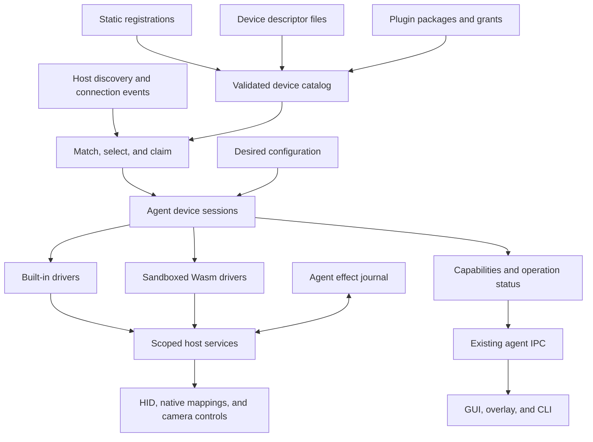

# Extensible peripheral architecture

Status: proposed design, 2026-10-01. Baseline: `bd5c1e7` (`v0.8.11`). The APIs, schemas, commands, and module names proposed below are not implemented or released.

OpenLogi can retain its process and crate boundaries while supporting devices from multiple manufacturers. The missing boundary is between device identification, driver selection, and capability execution. Adding more product IDs to the current standalone inventory does not establish that boundary.

The complete design supports three extension forms:

| Extension form | Supplies | Execution | Appropriate use |
| --- | --- | --- | --- |
| Built-in driver with static registrations | Compiled protocol implementation and device facts | Native code in the agent | HID++, existing Litra control, platform integrations |
| Loadable device descriptor | Matching rules, presentation, and validated parameters for an installed driver | No executable code | A new model that uses an existing protocol or native mapping service |
| Dynamic code plugin | A Wasm component, descriptors, and declared permissions | A separate Wasmtime store for each device session, inside the agent | A new protocol, report decoder, or stateful device controller |

All three forms produce the same catalog entries and capability contracts. They do not create three inventories, configuration systems, or UI frameworks. A descriptor can reference a built-in driver or an installed code plugin.

The user confirmed that plugins do not need to call native vendor SDKs. The proposed executable format is therefore a sandboxed Wasm component. Native dynamic libraries, arbitrary executables, a plugin marketplace, firmware updates, and plugin-supplied UI code are outside this design. These exclusions do not remove dynamic code execution.

## Existing boundaries and required changes

| Current owner | Evidence at the baseline | Design consequence |
| --- | --- | --- |
| [Device registry](../crates/openlogi-device-registry/src/lib.rs) | A `no_std` registry already owns receiver and Litra facts | Extend the registry; do not create a competing identity table |
| [HID backend](../crates/openlogi-device/src/backend.rs) | `HidBackend` opens HID++ channels and raw output writers | Retain this protocol seam; it is not a universal driver interface |
| [Standalone discovery](../crates/openlogi-device/src/inventory/standalone.rs) | `enumerate_standalone` directly calls `find_litra` | Move selection to a catalog with explicit driver bindings |
| [Device types](../crates/openlogi-core/src/device.rs) | `Capabilities` describes HID++ features; `StandaloneDevice` adds optional light fields | Introduce composable capability records without adding one optional field per category |
| [Button identity](../crates/openlogi-core/src/binding/button.rs) | `ButtonId::Control` contains a HID++ CID | Add a distinct standard HID usage source; never interpret a CID as a HID usage |
| [Physical identity](../crates/openlogi-core/src/device_order.rs) | Physical keys, routes, and model facts already have different roles | Preserve this distinction and represent devices with no trustworthy physical key |
| [Configuration](../crates/openlogi-core/src/config/device.rs) | `DeviceConfig` accumulates category-specific settings | Normalize settings by capability at a migration boundary |
| [Desktop records](../crates/openlogi-desktop/src/state/devices.rs) and [tabs](../crates/openlogi-desktop/src/app.rs) | Routing and presentation still contain category-specific branches | Consume normalized records and reuse capability panels |
| [Camera discovery](../crates/openlogi-camera/src/lib.rs) and [desktop runtime](../crates/openlogi-desktop/src/runtime.rs) | Cameras are Logitech-filtered and the GUI enumerates them separately | Adapt camera identity and controls explicitly; camera preview remains a separate media path |

Reuse the existing [atomic config save and external-edit check](../crates/openlogi-core/src/config/file.rs), [save-and-reload flow](../crates/openlogi-desktop/src/state.rs), [reconnect and wake reconciliation](../crates/openlogi-agent-core/src/orchestrator.rs), and [serialized light writes](../crates/openlogi-agent-core/src/hardware/light.rs).

Reuse the ownership principles of [HID++ session restoration](../crates/openlogi-device/src/session/restore.rs). Do not reuse its protocol-specific restore tokens for an OS property with different persistence and conflict behavior.

## Runtime ownership



The agent owns catalog activation, device claims, driver sessions, hardware writes, and recovery. The GUI does not load plugins or open HID devices. CLI diagnostics retain their existing direct-access exception; loading arbitrary plugins during passive CLI enumeration is not part of that exception.

This retains the [one-agent decision](DECISIONS.md#2026-08-the-agent-stays-one-process-a-crossing-edge-gets-a-wire-not-an-event-layer). Built-in hook and HID++ handling gain no new process boundary, serialization step, or generic event bus. Plugin calls run on bounded workers away from the hook thread. Direct typed calls and per-session queues are sufficient.

Wasm traps are contained within the affected store. A runtime vulnerability, host panic, or process-wide allocation failure can still affect the agent. This is language-runtime isolation, not a claim that every native process failure is contained. Revisit a process boundary only if that stronger isolation becomes a requirement.

## Device identity, endpoints, and claims

Use the following distinct concepts in `openlogi-core::peripheral`:

| Concept | Meaning | Persistence |
| --- | --- | --- |
| `ModelId` | A manufacturer/model identity, such as `dji.mic3.rx` | Stable catalog and configuration reference |
| `PhysicalDeviceId` | A namespaced, trustworthy unit identity with its evidence | Optional; preserve existing Logitech physical keys |
| `EndpointId` | An OS-discovered interface, HID collection, or protocol child route | Connection-local |
| `SessionId` | An endpoint claim plus a monotonically changing attachment generation | Agent-local |
| `CapabilityId` | A stable semantic function within a device, such as `input-remap/main` | Stable across driver updates |
| `DriverId` | The implementation selected for an endpoint group | Stable; separate from model and assets |

A USB receiver, its audio interface, its HID interface, and its paired transmitters are not interchangeable identities. Discovery publishes endpoint metadata and parent relationships. A driver can group siblings only through verified topology or protocol evidence. Matching equal VID/PID values is not evidence that two endpoints belong to one physical unit.

Each endpoint observation includes its transport, available matching fields, parent relation, and a generation. Unknown interface or usage fields remain unknown; they do not satisfy an exact selector. OS paths, LocationID, and RegistryID can locate a current endpoint. They do not become persistent physical keys. A serial becomes identity only when its driver has evidence that the serial is suitable; otherwise it remains display metadata.

Configuration has three explicit scopes:

| Scope | Semantics |
| --- | --- |
| Physical | Follow a verified physical unit across known routes |
| Model | Apply to every matching unit of the selected model; present this scope to the user |
| Session | Apply only to the current attachment; do not promise persistence after reconnect |

The driver advertises which scopes its backend can enforce. A physical identity does not imply that the underlying OS mapping API can target that unit.

Claims have two layers. A transport claim serializes protocol access to an endpoint group; an effect claim identifies the setting that a driver owns. Examples of effect claims are a light's brightness and a native mapping's source usage. Read sharing must be declared by the host service. Raw protocol writes remain exclusive at the endpoint group, because report IDs alone do not establish independent state machines.

The existing HID++ receiver session remains the exclusive owner of its shared channel and multiplexes paired children. A plugin must not open a second channel to one of those children. A composite microphone's HID claim does not claim its audio interface.

## Catalog and deterministic selection

The static registry remains a pure source of hardware facts. Runtime registrations additionally bind a `DriverId` to an implementation, parameter schema, supported host services, and permission requirements.

Keep an explicit built-in binding table in the agent. Use ordinary Rust constructors or function pointers; linker discovery and registration macros are unnecessary. The table references registry facts rather than copying VID/PID classification logic.

The catalog loader normalizes compiled records, descriptor files, and plugin descriptors into one immutable catalog generation:

1. Parse the complete proposed generation and validate references before activation.
2. Reject duplicate IDs, unsupported schemas, missing drivers, invalid selectors, and ungranted execution requirements with source locations.
3. Preserve the active generation when an update is rejected, and publish the rejection. A rejected generation is never reported as active.
4. Reconcile only sessions whose selected registration, parameters, permissions, or implementation changed.

Establish the compiled catalog before loading external sources. Validate each descriptor file or complete plugin package as one source transaction; an invalid source is quarantined with diagnostics. Independent valid sources can still activate. A rejected edit can retain the last accepted source, but an unavailable pinned version must not run a different version under that pin. Driver conflicts affect the contested endpoint group, not unrelated devices.

Load descriptors on startup and explicit reload. Reuse the existing reload entry point; a new file-watching service is not required. Installation and enumeration do not enable device writes.

Selection is deterministic:

1. Filter candidates by exact endpoint metadata, platform support, installed implementation, and granted services.
2. Honor an explicit user selection of descriptor and driver. If the selection is unavailable, publish `DriverUnavailable`; do not choose another driver silently.
3. Preserve a built-in owner unless the user has explicitly selected an external replacement for that scope.
4. Among the remaining candidates, prefer a selector only if its accepted endpoint set is a strict subset of every competing selector's set.
5. If candidates tie or are incomparable, publish `DriverConflict` and perform no probe or write.
6. Acquire all declared endpoint claims together, then probe within the granted operations. Commit the session only after capability validation.

Selectors are finite alternatives of exact fields. Fields within one alternative are ANDead; alternatives for the same endpoint role are ORed. All required roles must resolve within one verified endpoint group. There are no arbitrary predicates, regexes, plugin-supplied scores, or priority integers. A selector with an interface constraint outranks the same selector without that constraint. An interface-only refinement and a usage-only refinement can be incomparable; file order must not decide the winner.

Two descriptors with equal matches can share an implementation but still have conflicting parameters. Do not merge their fields. Catalog diagnostics show the candidates, the selected owner, the reason, and any explicit override.

## Capability contracts

Expose a `PeripheralRecord` containing identity, endpoints, selected driver provenance, connection status, and a list of capability records. `DeviceKind` remains a presentation hint.

Each capability record contains a semantic ID, a contract version, typed limits or controls, supported configuration scopes, availability, and evidence. Evidence distinguishes declared metadata, a successful probe, and a last-known offline value. A declaration alone does not establish successful device behavior.

Use typed capability families:

| Family | Shared contract | Driver responsibility |
| --- | --- | --- |
| Input remapping | Control IDs, source types, triggers, supported target kinds, application scope | Native mapping, device programming, or normalized input events |
| Pointer and scroll | DPI ranges/presets, supported wheel settings | Protocol units and writes |
| Light and illumination | Existing normalized brightness, Kelvin, and supported color/zone contracts | Report encoding and state readback |
| Camera controls | Supported controls, ranges, values | UVC or manufacturer-specific control path |
| Device information and telemetry | Product facts, battery/state observations | Probe and update policy |
| Extension settings | Namespaced, versioned, bounded scalar/enum fields | A custom setting's meaning and protocol |

Retain specialized controls such as SmartShift and host switching as typed capabilities when their drivers migrate. Do not replace those controls with a universal property bag.

An input control has a stable `ControlId`, localized label, typed source, and explicit trigger semantics. Source variants distinguish `HidUsage { page, usage }`, `HidppControl { cid }`, existing mouse buttons, and a driver-defined logical control. IDs and configuration references do not change when a label is translated.

Reuse existing actions and target selectors. The capability restricts the offered targets: a native single-key mapper can offer keyboard keys without offering a macro, long press, or arbitrary action that its backend cannot execute. HID usage and OS virtual keycode conversion have separate typed owners.

Plugin input events enter the existing action dispatcher only for declared controls and user-configured bindings. A plugin cannot request arbitrary application commands or global key injection. The host tracks held states; session failure releases any host-owned synthesized state and cancels pending gestures. Native OS mapping does not enter that synthesis path.

Extension settings support booleans, bounded integers, finite numbers with units/ranges, enum tags, and bounded text. Each field has a stable key, access mode, label, and optional default. Keys, types, sizes, and values are validated at the boundary. V1 excludes arbitrary nested JSON, file pickers, executable snippets, and custom layouts. A new cross-device behavior should become a typed capability rather than an expanding opaque command surface.

The GUI selects existing panels by capability, and uses a generic control list where no device silhouette exists. Plugins supply data and localization, not GPUI code, HTML, or scripts. Asset references use the existing asset registry; plugin installation does not add a second remote asset fetcher. Unsupported capability versions remain visible as unavailable by ID/version, and their saved settings remain intact. A required unsupported capability prevents attachment; optional unsupported capabilities receive no commands.

Camera preview and audio/video streaming do not pass through the plugin event ABI. Normalize camera inventory and control ownership with an explicit adapter; preserve the current native preview path and its permission identity until that separate migration is verified.

## Loadable descriptor format

V1 uses TOML, matching the repository's configuration format. Descriptors live in `devices.d/` under OpenLogi's existing configuration directory, or inside an installed plugin package. The loader resolves all paths through the existing application path owner.

The common envelope is:

| Field | Requirement |
| --- | --- |
| `schema` | Supported descriptor major version; V1 is `1` |
| `id`, `revision` | Unique namespaced descriptor ID and immutable semantic version |
| `model`, `name` | Stable model ID and human-readable default name |
| `driver` | Installed implementation ID and that implementation's parameter-schema version |
| `platforms` | Nonempty subset of `macos`, `linux`, `windows` |
| `identity` | Driver-supported identity strategy and permitted default configuration scope |
| `matches` | Nonempty selector alternatives, each with an endpoint role and transport |
| `parameters` | Data validated by the selected driver's declared schema |

V1 transport selectors cover USB HID, Bluetooth HID, and UVC endpoints supplied by current host adapters. Future network or BLE GATT transports require an explicit discovery and host-service contract; a plugin cannot create a new transport by naming an arbitrary string.

HID selectors require VID, PID, usage page, and usage. USB interface number and report ID can further constrain a match when the platform exposes those fields. UVC selectors require VID/PID and a camera role. Product strings are labels, not sole matching keys.

Reject unknown common fields, numeric overflow, duplicate control IDs, inconsistent role definitions, unsupported identity policies, empty selectors, and excessive counts. Repeated match alternatives for one role are allowed. Descriptor, model, and driver IDs use bounded namespaced ASCII identifiers; IDs cannot contain path separators. Validate driver parameters before hardware access. Descriptors cannot contain shell commands, bytecode, report-writing recipes, environment interpolation, remote includes, or arbitrary library paths. A new protocol requires executable driver code.

This complete example describes the verified DJI Mic 3 mapping. It is a proposed descriptor, not a file accepted by the released application:

```toml
schema = 1
id = "org.openlogi.dji-mic3-usb"
revision = "1.0.0"
model = "dji.mic3.rx"
name = "DJI Mic 3"
driver = { id = "org.openlogi.native-hid-remap", parameters = 1 }
platforms = ["macos"]
identity = { strategy = "unverified", default_scope = "model" }

[[matches]]
role = "controls"
transport = "usb-hid"
vendor_id = 0x2ca3
product_id = 0x4015
usage_page = 0x000c
usage = 0x0001

[parameters]
endpoint = "controls"
write_scope = "vid-pid"

[[parameters.controls]]
id = "linking"
labels = { en = "Linking button", zh-CN = "连接键" }
source = { kind = "hid-usage", page = 0x000c, usage = 0x00e9 }
trigger = "short-press"
recommended_key = "F18"
```

The built-in `native-hid-remap` driver V1 owns this parameter schema: one matched role, `vid-pid` write scope, and a nonempty list of uniquely sourced short-press controls with keyboard-key recommendations. The recommendation does not enable a mapping. The host derives the native selector from the matched VID/PID, validates that the write scope is disclosed, and offers only supported keyboard targets.

Interface `2`, report ID `1`, and maximum input report size `3` are known DJI observations. They belong in diagnostics and fixtures; they are not additional requirements for the already verified `hidutil` selector. No raw report decoding is needed for this driver.

Compiled DJI metadata and a loaded descriptor normalize to the same record. The shipped match facts have one registry owner; the example is documentation, not a second production table.

## Driver session interface

Separate session orchestration from transport I/O. A driver receives scoped host-service handles, selected descriptor parameters, and normalized desired settings. It never receives the full user configuration or a global backend.

The internal Rust interface and external component interface implement these logical operations:

| Operation | Input | Result |
| --- | --- | --- |
| `attach` | Session context, endpoint roles, validated parameters | Typed capabilities and initial observations, or a typed failure |
| `apply` | Request ID, capability ID/version, desired revision, typed command | Accepted/pending or completed result; never an invented readback |
| `event` | Ordered device report, I/O completion, timer, or host lifecycle event | Updated observations and command completions |
| `detach` | Disable, disconnect, suspend, replacement, or shutdown reason | Bounded cleanup acknowledgement |
| `migrate-settings` | Stored schema version and that plugin's settings | New validated settings or an explicit migration failure |

`attach` may issue a granted probe, but it must not apply user settings merely because a device was discovered. `migrate-settings` runs without device handles. Built-in drivers can use their existing async Rust implementations; they do not need to serialize their arguments through the external ABI.

Logical types include `SessionContext`, `CapabilityDescriptor`, `CapabilityCommand`, `DriverEvent`, `OperationResult`, and `DriverError`. All commands and events are discriminated records with bounded payloads. A custom setting command identifies a declared field and a validated `SettingValue`. There is no unrestricted `execute(String, JSON)`.

Operations return bounded `DriverUpdate` lists containing observations, declared input events, operation completions, or a new capability revision. Returned capabilities must fit the descriptor's roles and grants. The host supplies session identity and generation; guest data cannot select another session. Commands include a request ID and complete at most once. Input events include a declared control ID and press, release, or trigger kind; the host enforces the declared trigger model and event ordering.

Capability semantics remain owned by core types. The plugin ABI has canonical WIT definitions with generated bindings; conversion at the plugin boundary must preserve those semantics. Do not hand-copy an ABI layout into Rust or expose Rust trait objects, allocator ownership, or bincode enum indices to external plugins.

## Dynamic code plugin contract

### Package and ABI

A V1 package is a directory containing `plugin.toml`, one `driver.wasm` component, and its referenced `*.device.toml` descriptors. A package exports one driver implementation and can support multiple models. Installation copies the package into a private immutable directory; a package is never loaded directly from a mutable download directory.

The loader computes a content digest over the manifest and referenced files. Every relative path must remain inside the package and name a regular file. Reject symlinks, traversal, unreferenced executable payloads, duplicate identities, and files that change during staging. A signature can establish publisher identity in a future distributor; a local digest establishes content identity, not publisher trust.

The proposed manifest for a synthetic conformance device is:

```toml
schema = 1
id = "dev.example.counter-button"
version = "0.1.0"
world = "openlogi:peripheral/driver@1.0.0"
entry = "driver.wasm"
descriptors = ["counter.device.toml"]
platforms = ["macos", "linux", "windows"]
parameter_schema = 1
settings_schema = 1

[[permissions]]
service = "hid"
endpoint = "controls"
operations = ["input"]
report_ids = [1]
max_report_bytes = 3

[settings.minimum_count]
type = "integer"
minimum = 1
maximum = 10
default = 1
labels = { en = "Presses per trigger" }
```

The matching descriptor for that example is:

```toml
schema = 1
id = "dev.example.counter-button.test-device"
revision = "1.0.0"
model = "example.counter-button"
name = "Synthetic counter button"
driver = { id = "dev.example.counter-button", parameters = 1 }
platforms = ["macos", "linux", "windows"]
identity = { strategy = "unverified", default_scope = "session" }

[[matches]]
role = "controls"
transport = "usb-hid"
vendor_id = 0xffff
product_id = 0x0001
usage_page = 0xff00
usage = 0x0001

[parameters]
```

This selector is for the test backend only and asserts no real hardware support. The example plugin declares no device parameters. A plugin that needs parameters includes a manifest `parameters` table using the same bounded field schema as `settings`; descriptors provide values for those fields. Unknown or missing required values fail catalog validation.

Field schemas require `type` and an English label. Numeric fields require minimum/maximum bounds; enums require a nonempty set of unique tags; text requires a maximum length. Optional defaults must satisfy the same schema. Settings also declare read-only or read/write access, defaulting to read/write. Locale labels use existing locale negotiation with the English label as the required fallback. No field can contain a guest-supplied validation program.

The component exports the five session operations above through `openlogi:peripheral/driver@1.0.0`. Its imports are the following named, typed host interfaces:

| Host interface | Operations and restrictions |
| --- | --- |
| Session | Read sanitized endpoint facts and granted capability handles for this session |
| HID | Subscribe to input; submit output or feature operations only when declared and granted |
| Native remapping | Request a typed mapping effect for declared controls; no raw `hidutil` arguments |
| Time | Monotonic time and bounded one-shot timers; no guest threads or blocking sleeps |
| Settings | Read this session's validated settings; no access to another plugin's configuration |
| Diagnostics | Emit rate-limited structured messages with control characters escaped |

V1 host HID framing is explicit: a report has a kind, an ID, and payload bytes excluding the ID. Report lengths in permissions count the ID byte. Unnumbered reports use ID `0`; each platform adapter performs the native framing conversion once. Feature reads, feature writes, output writes, and input subscriptions are separate grants.

An I/O submission returns a request ID. Endpoint handles are component resources issued by the host and bound to one store; a guest cannot manufacture a handle from an OS path or an integer. The broker later delivers a completion or report to `event`; it does not block a Wasm worker on hardware. Completions contain the session generation and ordered sequence. Each submission has a host deadline and cancellation token. An uncertain write outcome is reported as uncertain, not automatically retried as a second write.

The counter-button component is executable stateful code: it decodes reports, counts rising edges, compares the count with `minimum_count`, resets its state, and returns a logical trigger in its updates. Its conformance trace includes press, duplicate press, release, and another press. With `minimum_count = 2`, only the last event emits a trigger. The host applies the user's binding to that trigger. The host contains no counter-button protocol implementation.

This example proves the distinction between descriptors and code plugins: changing the counting algorithm requires replacing the component, while changing a supported model's selector requires only a descriptor.

### Sandbox and scheduling

Embed Wasmtime in the agent with the Component Model and Pulley interpreter enabled. Explicitly select the Pulley target for host pointer width and endianness; Wasmtime otherwise defaults to native code on macOS arm64/x86_64. Do not rely on that default.

Wasmtime's [Pulley documentation](https://docs.wasmtime.dev/examples-pulley.html) states that its normal APIs and supported Wasm features remain available. Pulley compiles Wasm into interpreted bytecode, with a substantial execution slowdown relative to native code. Device control and report decoding are the target workload. High-rate audio/video processing and replacing the existing hook hot path are not.

Use validated `.wasm` input. Reject externally supplied Wasmtime serialized artifacts such as `.cwasm`; [deserializing untrusted compiled artifacts is unsafe](https://docs.wasmtime.dev/examples-pre-compiling-wasm.html). V1 keeps compiled components in memory and does not add a persistent compiled-code cache.

Link only OpenLogi's declared host interfaces. Do not provide WASI filesystem, network, environment, process, terminal, or native-library imports. The [Wasm sandbox](https://docs.wasmtime.dev/security.html) cannot grant access that the host has not imported, but every imported host function remains a security boundary.

Use one store per device session, serialized calls within a store, bounded queues, and a shared bounded worker pool. Never share a store between unrelated physical devices. Guest memory is session state; persistent settings belong to the host.

Initial host-owned ceilings for the implementation are:

| Resource | Initial ceiling and behavior |
| --- | --- |
| Descriptor | 64 KiB, 64 selectors, 128 controls/fields |
| Plugin component/package | 8 MiB component; 16 MiB total referenced content |
| Store | 16 concurrent stores globally; 64 MiB linear memory per store; 256 MiB aggregate guest memory; bounded tables, stack, and host resource handles |
| Calls | 1,000,000 Wasm fuel units per call; 100 ms wall deadline excluding separately bounded I/O |
| Sustained work | 10,000,000 fuel units and 100 I/O submissions per session per second; fair scheduling across admitted stores |
| Queues | 256 pending events per session; report length bounded by both grant and host descriptor |
| Timers and writes | 32 timers and 16 outstanding I/O requests per session |

These are admission limits, not measured performance claims or an allocation promise. The runtime owns the constants and can lower admission under its global memory budget. A plugin cannot raise limits. Surface `ResourceLimit` instead of silently dropping releases or queue entries.

Use [fuel and epoch interruption](https://docs.wasmtime.dev/examples-interrupting-wasm.html) to stop nonterminating guest code. Charge host submissions separately because Wasm fuel does not bound host work. Timers and fresh events do not reset the sustained-work budget. Host I/O must remain deadline-bound and cancellable. On quota or queue overflow, invalidate the session and perform host cleanup rather than continuing with incomplete input state.

Compilation runs outside the input loop, one candidate at a time, with size/structural admission checks and aggregate memory accounting. Fuel does not constrain the compiler. Compiler failure and resource pressure remain part of the runtime risk; do not advertise a hard process-memory sandbox. Activation waits for compilation, so a failed candidate does not replace a working plugin.

Pulley is chosen to avoid runtime-generated native executable code and a default JIT entitlement expansion. The signed and notarized macOS agent must still pass a real load/execute/trap test. Do not silently switch to JIT, weaken library validation, add unsigned-executable-memory entitlements, or request root if that test fails. The existing agent signing currently supplies no JIT entitlement.

### Grants and package lifecycle

A grant is bound to a package content digest, descriptor selection, endpoint roles, operation kinds, and report constraints. The effective grant is the intersection of the package request, explicit user enablement, host policy, and observed endpoint limits. A manifest cannot grant itself permission.

Installation stages and validates a package without device access. Enabling the plugin presents its requested device operations and records the grant. Grant changes and replacement of a built-in owner require explicit user selection. The GUI may submit enable/disable requests, but the agent verifies and persists grants in its own state store.

Raw report access can affect the granted device in ways the host cannot infer from bytes. A sandbox does not prove a vendor command is reversible. V1 exposes no firmware, bootloader, pairing, recording, or general USB-control service. The DJI descriptor needs none of those operations and no raw report grant.

Update and removal follow this order:

1. Stage, hash, validate, and compile the candidate without replacing the active package.
2. Check the ABI, descriptor IDs, capability IDs, settings schemas, and grant changes.
3. Run settings migration against a copy with device services unavailable.
4. Quiesce old sessions and reconcile host-owned effects before activating the new digest.
5. Save the selected package digest and migrated desired settings in one `ConfigFile` revision through the existing config writer, then activate that revision.
6. On activation failure, report the failure and restore the previous selection through a guarded config save if its grants remain valid.

Keep the previous package and settings for rollback. A concurrent config edit aborts the save or rollback; never overwrite that edit. Report the desired and active digests separately if activation or rollback is incomplete. The agent submits a migration proposal to the config writer rather than introducing a second unchecked TOML writer. Package grants can be staged separately because a grant alone does not activate a package. On restart, the selected config digest must match a fully installed, compatible, granted package before any session starts. Compile the same staged bytes that were hashed; a directory name alone does not establish content integrity.

Updating executable content requires approval of the new digest even if its permission list is unchanged. No automatic download or background update service is required for V1.

Disable revokes new operations first, cancels in-flight work, reconciles owned effects, then drops stores. A guest `detach` failure cannot prevent host cleanup. Uninstall preserves user settings by default and retains unresolved recovery records until cleanup succeeds or the user explicitly discards them. Disconnect, plugin trap, and app shutdown use the same ownership path.

Automatic respawn of a trapping component is disabled for that connection. Publish `PluginFault`; an explicit retry, package replacement, or new attachment can start a fresh session. Repeated failure must not monopolize the worker pool or disrupt built-in devices.

## Desired state, applied state, and recovery

The user configuration remains the source of desired state. The agent maintains observed state, applied revision, and recovery state separately. Each command carries the selected session generation and desired revision; stale work is rejected before I/O and stale completions cannot publish success.

Reconciliation triggers are initial activation, explicit enable/disable, config reload, connection changes, wake, and plugin replacement. Reuse the existing inventory/watch lifecycle. Read current state when a service supports readback; do not rewrite settings merely because another inventory poll completed. A failed enumeration marks the snapshot stale/unavailable; it does not prove every device disconnected.

Classify operations by persistence and restoration semantics:

| Operation kind | Reconciliation and cleanup |
| --- | --- |
| Volatile desired setting, such as light brightness | Reapply the current desired value on reconnect; retain the existing product's disable semantics |
| Owned temporary effect, such as a native key mapping | Record the original value and conditionally restore only the owned effect |
| Host input state, such as a held synthesized key | Cancel/release on session invalidation using existing action ownership |
| Irreversible operation | Outside the V1 driver contract |

Do not pretend several device writes form an atomic transaction. Track success, pending work, and failures per capability/effect. A GUI save can succeed while one device application fails; both results must remain visible.

The effect journal belongs to the agent, separate from GUI-owned TOML. Before a reversible write, durably record the effect key, original value, intended value, desired revision, target instance evidence, and a prepared phase. After readback, record the owned value and active phase. Recovery checks current state before deciding whether a prepared write happened. Journal failure prevents a new reversible write.

On restart, reconcile an existing journal before capturing a new baseline. An already applied F18 mapping must not replace the original saved mapping. Keep offline cleanup pending until the host can verify the target or establish that its effect lifetime ended. A new same-model attachment is not proof of the old target's identity.

Borrow the existing atomic-file and conflict-detection primitives, but give the journal its own single writer. Plugin-private settings do not store rollback obligations. Cleanup of a native mapping must work even if its plugin is disabled, removed, or broken.

### DJI Mic 3 native mapping slice

The supplied hardware evidence fixes the implementation path:

| Item | Verified value or constraint |
| --- | --- |
| Receiver | DJI Mic 3, Wireless Mic Rx, USB VID `0x2CA3` / PID `0x4015` |
| HID collection | Consumer Control, page `0x0C`, usage `0x01` |
| Control | Transmitter's lower linking button, short press |
| Source | Consumer Volume Increment, page `0x0C`, usage `0xE9` |
| Target | Keyboard F18, page `0x07`, usage `0x6D` |
| Native implementation | `/usr/bin/hidutil property` with mandatory VID/PID `--matching` |
| Native encoding | `(u64(page) << 32) | usage`; source `51539607785`, target `30064771181` |
| Separate OS-event encoding | CGEvent F18 virtual keycode `79`; never use this value as the HID usage |

The receiver exposes no verified TX1/TX2 identity in these events. Persist a disclosed model-scoped rule; do not manufacture a transmitter or receiver serial identity. Do not map usage `0xEA`. A roughly 4 ms down/up pair verifies a short-press trigger, not physical hold duration or push-to-talk support.

The existing [`KeyCombo` and `KeyboardUsage`](../crates/openlogi-core/src/binding/key_combo.rs) already parse F18 and store its keyboard usage. Reuse `KeyboardUsage::code()` with page `0x07`; only the native property's 64-bit packing needs a new owner. The existing [`FunctionKey::keycode`](../crates/openlogi-core/src/config/function_key.rs) returns the virtual keycode. Preserve that method's meaning and do not duplicate a key table in the UI.

Invoke `hidutil` with structured process arguments and decimal JSON integers. The host constructs `--matching {"VendorID":11427,"ProductID":16405}` from the selected descriptor. The plugin cannot omit or broaden the selector. This mapping acts on HID services and leaves audio configuration unchanged.

There is no current `hidutil` mapping manager in this repository. Add one host adapter and one agent effect owner, then reuse those owners for every native-mapping descriptor. Do not add a virtual keyboard, a new capture process, simulated keystrokes, or a private DJI protocol.

The mapping algorithm operates on the current property:

1. Read all affected services and the current `UserKeyMapping` arrays.
2. Preserve unrelated entries, order, and fields. If the owned source has duplicate or undecodable entries, report a conflict before writing.
3. On first enable, save the original entry for `0x0C/0xE9`, or its absence. Replace or append only that source.
4. On target change, retain the original entry and update the last-owned target after successful readback.
5. On disable, reread current state. If the source still equals the last-owned entry, restore the original or remove only that source.
6. If another writer changed or removed the source, keep the current value and report `ExternalModification`. Do not force the desired value on the next poll.

For example, if an unrelated key maps to F16 and Volume Increment originally maps to F17, enable replaces only Volume Increment with F18. If the unrelated key later changes to F15, disable retains F15 and restores F17. If Volume Increment itself later changes to F19, disable retains F19.

An external conflict suspends automatic reapplication for that effect until explicit resolution. Reconnect starts a new effect only after the host establishes a new attachment and captures its current baseline.

The proven `hidutil` setter is model-scoped and replaces a complete array. Do not assume it can address an individual event service by RegistryID. If several matching services have different arrays or different restore requirements, a shared setter cannot preserve them all: return `MappingScopeConflict` without writing. A narrower per-service API requires a separate verified host implementation. This restriction also covers a second identical receiver arriving while the first has an active mapping.

Journal target evidence may include a boot identifier and live registry address solely to establish that an old effect still belongs to the same OS service after an agent restart. Such evidence expires with that service or boot. It is not a physical identity or configuration key. Without evidence of the same target, never restore a previous receiver's baseline onto a new attachment.

`hidutil` offers no demonstrated atomic compare-and-swap for this property. Serialize all OpenLogi writes, reread before changes, and verify afterward, but document the remaining race with independent writers. A value-only comparison also cannot detect another writer changing a value away and back. Do not claim strict cross-process atomicity. Concurrent external writers and heterogeneous service arrays are explicit validation cases, not reasons to clear all mappings.

### Status and verification evidence

Publish independent status fields instead of one success boolean:

| Field | Examples |
| --- | --- |
| Configuration | Saved, save conflict, invalid settings |
| Connection | Online, offline, discovery unavailable |
| Application | Pending, applied, write failed, readback mismatch, restore pending |
| Driver | Ready, missing, incompatible, conflict, permission denied, plugin fault |
| Verification | Not observed, waiting for a press, raw event observed, system key observed, user-confirmed application result |

Errors include operation, scope, driver ID, and a bounded diagnostic cause. A development-tool sandbox failure is not evidence that the packaged app needs root. TCC denial, device absence, and configuration-write failure must remain distinct.

For DJI, successful property readback establishes that configuration was applied. It does not establish that Raycast received a key. A temporary diagnostic can observe raw or system events when explicitly started; no permanent diagnostic listener is required for mapping.

## Configuration and compatibility

The baseline user configuration schema is `7`; internal IPC protocol version is `34`. This design does not change either number. Implementation must bump the applicable versions and provide migration and wire tests.

Introduce a typed `PeripheralConfig` with explicit scope and capability-keyed settings. Retain `DeviceConfig` as a legacy reader during migration, then normalize once at the configuration boundary. Do not let both forms independently dispatch settings to the same device.

The following is a proposed configuration fragment; it omits the future schema header and is not valid released OpenLogi configuration:

```toml
[[peripherals]]
id = "dji-linking-button"
enabled = true
scope = { kind = "model", model = "dji.mic3.rx" }
descriptor = "org.openlogi.dji-mic3-usb"

[peripherals.capabilities."input-remap/main"]
version = 1

[peripherals.capabilities."input-remap/main".bindings]
linking = { CustomShortcut = "F18" }
```

The binding reuses the existing action representation and its already validated `KeyboardUsage`. The native capability additionally requires no modifiers, then packs the keyboard usage for the OS property. It never forwards this binding to the input injector. A disabled rule retains the desired target and starts conditional restoration.

Resolution applies catalog recommendations only as UI suggestions. A saved model rule supplies defaults for matching units; physical rules override model rules when enforceable; route overrides remain available for capabilities that differ by link. Reject ambiguous equal-precedence rules. Apply per-app overrides only when the capability advertises that scope; DJI's native mapping does not advertise per-app remapping.

Save and reload through the existing `ConfigFile` flow. Editing offline settings is allowed, but their application stays pending. A plugin's unknown or unavailable settings are preserved in their namespaced record with schema version, not discarded during an unrelated save. Malformed known settings remain errors.

Keep five independent version domains:

| Version | Compatibility rule |
| --- | --- |
| User config schema | Explicit migration; newer unsupported schema is not overwritten |
| Descriptor/manifest schema | Reject unsupported versions and unknown structural fields before activation |
| Plugin package version and digest | Select exact installed content; retain previous content for rollback |
| Plugin WIT world | Bind an explicitly supported world version; independent of application releases |
| Internal agent IPC | Existing strict-equal handshake and append-only wire rules |

The host can retain the `1.0.0` WIT world when a later world ships. A plugin names the world it imports/exports; a same-major number alone is not evidence that all required interfaces exist. Unknown required imports or required capability versions prevent activation. Unsupported optional capability/settings records remain inert and round-trip through storage.

Package upgrades cannot rename model, capability, control, or setting IDs without an explicit migration. Run migrations on a copy under the same sandbox limits and without device services. Keep the old settings version beside the rollback package until the update commits.

Append normalized inventory and capability operations to the [existing IPC contract](../crates/openlogi-ipc/AGENTS.md). Preserve old method and enum positions, bump the protocol version, and regenerate wire goldens. Use typed requests such as binding updates, light commands, and validated extension-setting updates. External WIT versioning does not relax internal bincode rules.

## Repository ownership and migration

The following is the intended module map, not scaffolding to add before implementation:

| Owner | Responsibility |
| --- | --- |
| `openlogi-core::peripheral` | Pure identities, normalized capability types, settings, statuses, and errors |
| `openlogi-device-registry` | Static matching facts and model/driver IDs; remains `no_std` |
| `openlogi-device` | Existing HID++/Litra protocol code and host-free protocol tests |
| `openlogi-hid` | HID host services and cfg-gated native mapping adapter |
| `openlogi-agent-core::peripherals` | Catalog normalization, selection, claims, sessions, reconciliation, and effect journal |
| New `openlogi-plugin` crate | Manifest/descriptor parsing, canonical WIT, host-interface contracts, generated boundary bindings, Wasmtime runner, and SDK-facing contract |
| `openlogi-agent` | Built-in binding table, host-service construction, package state and lifecycle wiring |
| `openlogi-ipc` | Normalized snapshot and typed operations for clients |
| `openlogi-desktop` / `openlogi-ui` | Capability presentation, existing target pickers, localization, and status rendering |
| `openlogi-camera` | Camera discovery/control adapter and existing native media path |
| `openlogi-fixture` | Existing replay foundation, extended only for actual new test boundaries |

Keep parsing and WIT definitions available without the Wasmtime runner feature so catalog validation does not require loading executable code. GUI and overlay consume only core/IPC data; they must not depend on the runner. A separate plugin SDK crate is justified only when an external consumer needs a published Rust helper beyond generated WIT bindings.

Dependencies point from the agent to core, protocol crates, host backends, and the plugin adapter. The plugin crate can depend on core types but never on agent-core; the agent implements the plugin crate's host interfaces. The session trait belongs to agent-core, which adapts both native drivers and the plugin runner. This keeps external execution details out of the registry and prevents a dependency cycle.

Use these implementation phases, with each phase retaining the completed work:

| Phase | Deliverable | Exit proof |
| --- | --- | --- |
| 1. Shared model and catalog | Normalized endpoint/capability records; explicit built-in bindings; adapt HID++ and Litra once | Existing inventory, settings, and reconnect tests pass through the shared projection without duplicate sessions |
| 2. Native mapping slice | DJI descriptor, F18 target, desired state, effect journal, status, reconnect/disable | Mapping merge/restore tests and the real DJI checklist below |
| 3. Descriptor loading | Versioned TOML loader, deterministic selection, explicit overrides, reload diagnostics | A new synthetic supported model loads without recompiling the app; ambiguous matches perform no I/O |
| 4. Dynamic plugins | WIT contract, package lifecycle, grants, Wasmtime/Pulley execution, stateful example | A component with new decoding logic loads at runtime; fault and permission tests pass on all supported hosts |
| 5. Consumer and category migration | Capability-based UI/config, camera identity/control adapter, removal of old duplicate projections | Legacy configurations round-trip and existing HID++, light, and camera workflows retain behavior |

All five phases are required for the complete architecture. Phase 2 is an independently useful DJI delivery, not a claim that dynamic plugins are finished. Do not defer Phase 4 indefinitely under the name of a generic registry.

When moving an existing decision, remove its second owner and add the repository's required ast-grep guard. Examples are VID/PID classification outside the registry, direct native mapping writes outside the host adapter, and capability selection reconstructed in clients. Do not add a global bus or rewrite working HID++ protocol code as part of this migration.

## Validation plan

Tests must prove transformations, ownership, lifecycle, and boundary behavior. Tests that only compare declared constants do not prove this design.

| Requirement | Concrete proof |
| --- | --- |
| One catalog for all extension forms | Feed equivalent compiled and loaded descriptors to the same matcher; assert the same selected driver and capabilities |
| Deterministic ownership | Permute load order, test strict refinements and incomparable selectors, and assert no probe/write occurs on conflict |
| Physical versus model scope | Attach two identical units without trustworthy serials; assert distinct sessions and an explicitly shared model rule |
| Composite and receiver isolation | Exercise a microphone's audio/HID siblings and receiver children; assert claims never open unrelated interfaces or duplicate receiver channels |
| Capability limits | Reject unsupported hold triggers, targets, per-app scope, malformed settings, and undeclared plugin controls before dispatch |
| Descriptor reload | Reject unknown fields, missing drivers, traversal, and invalid updates; assert active sessions retain their last accepted generation with an error |
| Meaningful native mapping restoration | Start with unrelated and same-source mappings; enable, change target, edit unrelated/current source externally, disable; assert exact surviving entries |
| Crash-safe effects | Interrupt before write, after write, and before journal completion; recover without overwriting a new service or a later external change |
| Reconnect and stale work | Disconnect during a write, attach a replacement, and release the old completion; assert no old generation publishes or writes to the replacement |
| Actual dynamic execution | Run the counter-button component and replace its algorithm without rebuilding the host; assert the emitted event trace changes |
| Sandbox enforcement | Attempt undeclared imports, cross-session handles, excessive reports, infinite loops, memory growth, and queue overflow; assert typed faults and continuing built-in operation |
| Plugin update/removal | Exercise incompatible worlds, schema migration failure, changed grants, invalid candidate content, rollback, and unavailable guest cleanup |
| Host portability | Run plugin conformance on macOS, Linux, and Windows; unsupported host services report unavailable rather than selecting a different mechanism |
| IPC and UI | Golden-test wire additions; use existing mock-agent/UI workflows for a mic-only control list, offline state, restore conflict, and plugin fault |
| Existing devices | Run affected HID++ replay, light serialization, config migration, and camera control tests; compare inventory and action traces before/after |
| Packaging and performance | Execute the component in the signed macOS agent without JIT permission changes; measure startup, memory, plugin event latency, and built-in hook latency against the same baseline |

Use the existing [fixture/replay architecture](MOCK_DEVICE_TESTING.md) and focused crate tests for the owner being changed. Add an actual component artifact built from the conformance example when the runner exists. Do not fake dynamic execution by registering another native Rust test driver.

Before selecting runtime dependency versions, verify the current stable Rust toolchain compatibility and all shipping targets. Record the chosen version, features, and license in the implementation change. This document adds no dependency or installation prerequisite.

### Real DJI acceptance

The user supplied successful raw HID, macOS F18, and Raycast shortcut evidence for the native mapping path. That evidence validates the chosen mechanism; it does not certify a future OpenLogi implementation.

Run the following against the packaged implementation:

1. Attach the DJI Mic 3 USB receiver and verify the model, Consumer collection, and model-scoped configuration label.
2. Record existing mappings on all affected services and a control keyboard before enabling the OpenLogi binding.
3. Select F18 for the linking button and enable the binding.
4. Short-press the lower linking button once. Observe one raw `0x0C/0xE9` down/up pair and one system F18 down/up pair. Do not match the complete observed flags value.
5. In Raycast, open Dictation → Commands → Dictate → Record Hotkey, then press the linking button inside the recording overlay. Confirm F18 is recorded.
6. Disable the binding and verify restoration of the captured original behavior, including a pre-existing same-source mapping.
7. Confirm unrelated mappings and another keyboard retain their current behavior.
8. Repeat enable/disable after receiver replug, GUI restart, agent restart, and an app update. Check both persisted desired state and restoration.
9. Test an external mapping edit and multiple matching services with different arrays. Confirm the implementation reports a conflict without destructive writes.
10. Confirm microphone audio input still works before and after these steps.

Never request a long press or double press as the test gesture. Do not use a green LED as event evidence. OpenLogi does not edit Raycast's settings or infer application verification from a successful property write.

References: [DJI Mic 3 manual](https://dl.djicdn.com/downloads/DJI%20Mic%203/202508282/DJI_Mic_3_User_Manual__EN.pdf), [Raycast hotkey documentation](https://manual.raycast.com/command-aliases-and-hotkeys). Earlier DJI projects with PID `0x4011`, simulated input, or Mic Mini private commands do not change this Mic 3 path.

### Design verification and remaining implementation gates

This change can validate Markdown links, TOML syntax, example references, and consistency between the contracts. It cannot validate a loader, runner, native mapping manager, or hardware behavior that has not been implemented.

Real hardware acceptance is not completed by this design change. The signed Pulley runtime test, mapping behavior with multiple event services, external-writer race behavior, runtime resource measurements, and the complete DJI checklist remain implementation gates.
